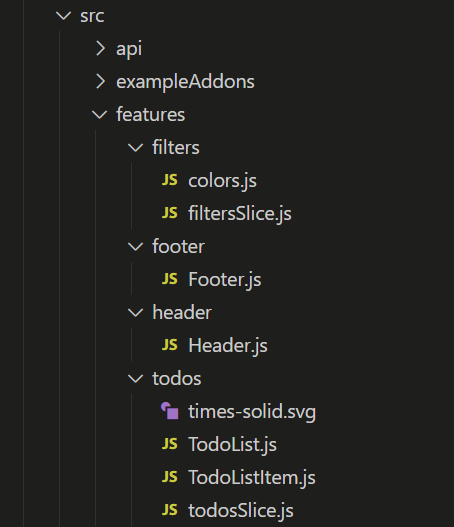
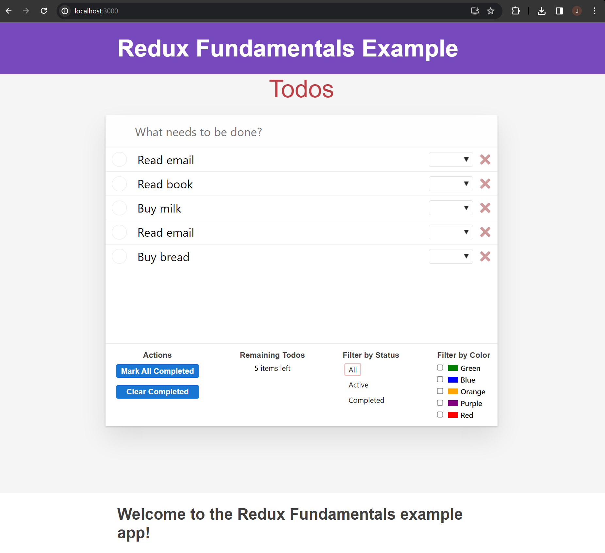
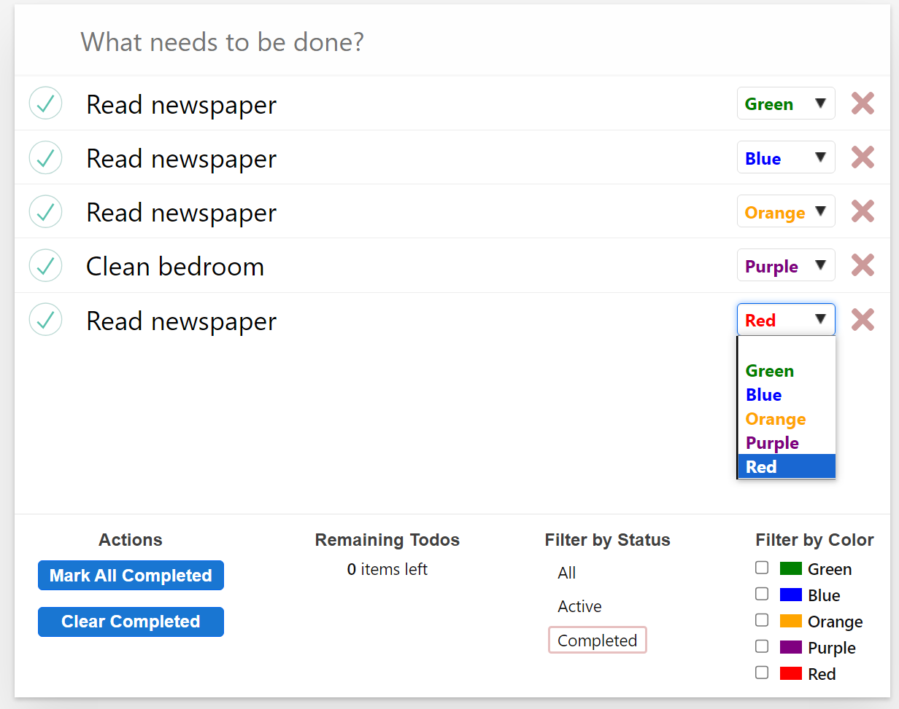

# web603-class-w6d2

## Getting Started

## Replicate App File Structure
With `web603-class-w6d2` as the current directory, create a folder called `todo-list`.

File structure at last:


### Installing Dependencies

```bash
$ npm install classnames miragejs react react-dom react-redux react-scripts redux seedrandom

$ npm install @reduxjs/toolkit @testing-library/jest-dom @testing-library/react @testing-library/user-event

$ npm install --save-dev prettier
```

And then install an earlier version of `faker`.

```bash
$ npm install faker@4.1.0
```

### Completing Code

Complete the code based on the In-Class Exercise.

## Test

With `todo-list` as the current directory, run `npm start`. After the app being successfully compiled and opened, you should see the app opening in the browser without any error messages showing.

### App Home



### Filtering Functionality


